# Project Structure

Complete layout of the ionosense-hpc-lib codebase with documentation links.

## Directory Tree

```
ionosense-hpc-lib/
│
├── bindings/                   # C++/Python binding configurations
│   └── bindings.cpp              # pybind11 entrypoint, exposes C++ research engine to Python
│
├── include/                    # C++ public headers
│   └── ionosense/                # Main library header directory
│       ├── cuda_wrappers.hpp     # RAII wrappers for CUDA/cuFFT resources (streams, events, handles)
│       ├── processing_stage.hpp  # Abstract interface for processing stages
│       └── research_engine.hpp   # Public C++ API for the research engine
│
├── src/                        # C++ source code implementations
│   ├── ops_fft.cu                # CUDA kernels for windowing and magnitude calculations
│   ├── processing_stage.cpp      # Implementations for concrete processing stages
│   └── research_engine.cpp       # ResearchEngine implementation details
│
├── tests/                        # C++ unit tests
│
│
│
├── python/                   # Python package source and tests
│   ├── src/                    # Source code for the Python package
│   │   └── ionosense_hpc/        # The main Python package
│   │       ├── __init__.py       # Initializes the Python package
│   │       ├── __version__.py    # Defines the package version
│   │       ├── exceptions.py     # Custom exception types for the library
│   │       │
│   │       ├── benchmarks/       # Performance benchmarking tools
│   │       │   ├── __init__.py     # Makes benchmarks a sub-package
│   │       │   ├── accuracy.py     # Accuracy benchmark scripts
│   │       │   ├── latency.py      # Latency measurement scripts
│   │       │   ├── realtime.py     # Real-time performance tests
│   │       │   ├── suite.py        # Main benchmarking suite runner
│   │       │   └── throughput.py   # Throughput measurement scripts
│   │       │
│   │       ├── config/           # Configuration management
│   │       │   ├── __init__.py     # Makes config a sub-package
│   │       │   ├── presets.py      # Pre-defined configuration presets
│   │       │   ├── schemas.py      # Validation schemas for configurations
│   │       │   └── validation.py   # Configuration validation logic
│   │       │
│   │       ├── core/             # Core Python logic wrapping the C++ library
│   │       │   ├── __init__.py     # Makes core a sub-package
│   │       │   ├── engine.py       # High-level Python engine interface
│   │       │   ├── processor.py    # Main processor class for data handling
│   │       │   └── raw_engine.py   # Low-level wrapper around the C++ engine
│   │       │
│   │       ├── stages/           # Python representations of processing stages
│   │       │   ├── __init__.py     # Makes stages a sub-package
│   │       │   ├── definitions.py  # Definitions of available stages
│   │       │   └── registry.py     # Registry for managing stages
│   │       │
│   │       ├── testing/          # Utilities for testing the Python code
│   │       │   ├── __init__.py     # Makes testing a sub-package
│   │       │   ├── fixtures.py     # Pytest fixtures for tests
│   │       │   └── validators.py   # Data validation helpers for tests
│   │       │
│   │       └── utils/            # Utility functions
│   │           ├── __init__.py     # Makes utils a sub-package
│   │           ├── device.py       # GPU device management utilities
│   │           ├── logging.py      # Logging configuration
│   │           ├── profiling.py    # Performance profiling tools
│   │           ├── reporting.py    # Result reporting utilities
│   │           └── signals.py      # Signal generation and processing tools
│   │       
│   │
│   └── tests/                    # Python unit and integration tests
│       ├── conftest.py             # Pytest configuration and shared fixtures
│       ├── ...
│       └── test_*.py               # Tests for python
│
│
│
├── research/              # Experiments, analysis, and reports
│   ├── notebooks/           # Exploratory notebooks and visualizations
│   ├── data/                # Datasets for experiments
│   │   ├── raw/               # Original, immutable data sources
│   │   └── processed/         # Cleaned, transformed, or feature-engineered data
│   │
│   ├── experiments/         # Reproducible experiment scripts
│   ├── results/             # Output from experiments (plots, tables, models)
│   │   ├── figures/           # Generated plots and visualizations
│   │   ├── tables/            # Tabular data and summary statistics
│   │   └── models/            # Saved, trained model artifacts
│   │
│   ├── reports/             # Project reports, papers, and presentations
│   └── configs/             # Configuration files for experiments & benchmarks
│
│
│
├── scripts/                    # Command-line interface and utility scripts
│   ├── cli.ps1                   # PowerShell CLI script for Windows
│   ├── cli.sh                    # Bash CLI script for Linux/macOS
│   └── start-devshell-x64.ps1    # Script to initialize the development environment on Windows
│
├── .github/                  # GitHub-specific files
│   └── workflows/              # Continuous integration workflows
│       └── ci.yml                # CI pipeline for building and testing
│
├── docs/                       # Project documentation
│   ├── BENCHMARKS.md             # Documentation on performance benchmarks
│   └── DEVELOPMENT.md            # Guide for developers contributing to the project
│
├── environments/                 # Conda environment configuration files
│   └── environment.*.yml
│
├── .dockerignore                 # Specifies files to ignore in Docker builds
├── .gitignore                    # Specifies files for Git to ignore
├── CMakeLists.txt                # Root CMake build script
├── CMakePresets.json             # Presets for CMake configuration
├── Dockerfile                    # Docker configuration for containerization
├── PROJECT_STRUCTURE.md          # This file, the project structure overview
├── README.md                     # Main project README with overview and setup instructions
└── pyproject.toml                # Python project configuration (PEP 518)
```

## Component Map

<p align="center">
  
</p>

### another diagram, just the code structure

<p align="center">
  
</p>

### and now c++/cuda source architecture

<p align="center">
  
</p>


## Key Files

### Configuration Files

| File | Purpose |
|------|---------|
| `CMakeLists.txt` | Main build configuration |
| `CMakePresets.json` | Platform-specific build presets |
| `environment.linux.yml` | Linux Conda environment |
| `environment.win.yml` | Windows Conda environment |
| `pyproject.toml` | Python package metadata |

### Core Implementation

| File | Lines | Purpose |
|------|-------|---------|
| `src/fft_engine.cpp` | ~400 | Stream management, memory, graphs |
| `src/ops_fft.cu` | ~100 | CUDA kernel implementations |
| `bindings/bindings.cpp` | ~120 | Python bindings |
| `include/ionosense/fft_engine.hpp` | ~80 | Public C++ API |

### Scripts

| Script | Command Examples |
|--------|------------------|
| `cli.sh` | `./scripts/cli.sh build`<br/>`./scripts/cli.sh test`<br/>`./scripts/cli.sh bench raw_throughput` |
| `cli.ps1` | `.\scripts\cli.ps1 setup`<br/>`.\scripts\cli.ps1 profile nsys realtime` |

## Build Outputs

### Linux Build (`build/linux-rel/`)
```
build/linux-rel/
├── compile_commands.json    # For IDE integration
├── test_engine             # C++ test executable
└── CMakeCache.txt          # CMake configuration cache
```

### Windows Build (`build/windows-rel/`)
```
build/windows-rel/
├── test_engine.exe         # C++ test executable
├── Release/
└── CMakeCache.txt
```

### Python Module Location
```
python/ionosense_hpc/core/
├── _engine.so              # Linux
└── _engine.pyd             # Windows
```

## Development Workflow

### 1. Environment Setup
```bash
# Linux
./scripts/cli.sh setup
conda activate ionosense-hpc

# Windows
.\scripts\cli.ps1 setup
conda activate ionosense-hpc
```

### 2. Build
```bash
# Full build
./scripts/cli.sh build

# Debug build
./scripts/cli.sh build linux-debug

# Clean rebuild
./scripts/cli.sh rebuild
```

### 3. Test
```bash
# All tests
./scripts/cli.sh test

# C++ only
ctest --preset linux-tests

# Python only
pytest python/tests -v
```

### 4. Benchmark
```bash
# List benchmarks
./scripts/cli.sh list benchmarks

# Run benchmark
./scripts/cli.sh bench raw_throughput -n 4096

# Profile
./scripts/cli.sh profile nsys raw_throughput
```

## Documentation Index

| Document | Audience | Purpose |
|----------|----------|---------|
| [README.md](README.md) | Everyone | Project overview, quick start |
| [src/README.md](src/README.md) | C++ Developers | Source code architecture |
| [bindings/README.md](bindings/README.md) | Binding Developers | Python interface details |
| [python/README.md](python/README.md) | Python Users | API usage guide |
| [docs/DEVELOPMENT.md](docs/DEVELOPMENT.md) | Contributors | Development guide |
| [docs/BENCHMARKS.md](docs/BENCHMARKS.md) | Researchers | Performance methodology |

## Git Workflow

### Branch Structure
```
main            # Stable releases
├── develop     # Integration branch
├── feature/*   # New features
├── fix/*       # Bug fixes
└── perf/*      # Performance improvements
```

### Commit Convention
```
type(scope): description

- feat: New feature
- fix: Bug fix
- perf: Performance improvement
- docs: Documentation
- test: Testing
- build: Build system
```

## Dependencies

### Build Dependencies
- CMake ≥3.26
- CUDA Toolkit ≥12.0
- C++17 compiler (GCC 11+, MSVC 2022)
- Python 3.11

### Runtime Dependencies
- CUDA driver ≥525
- cuFFT library
- NumPy ≥1.24

### Python Dependencies
```
numpy           # Array operations
pybind11        # C++ bindings
pytest          # Testing
tqdm            # Progress bars
```

## Performance Targets

| Metric | Target | Current |
|--------|--------|---------|
| Latency (dual FFT) | <110 μs | ~180 μs |
| Throughput (4K FFT) | >1M/s | 1.2M/s |
| Memory Transfer | <40% time | 38% |
| RMS Error | <1e-5 | 8.3e-6 |
