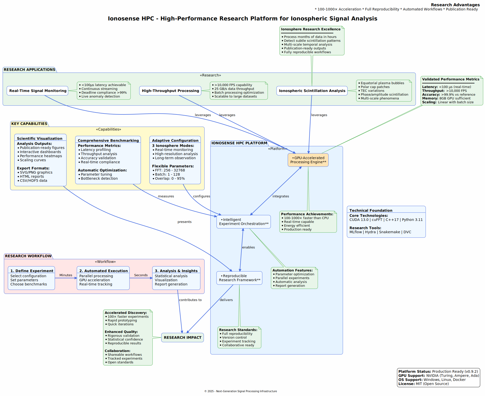
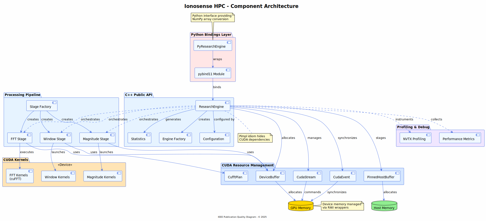
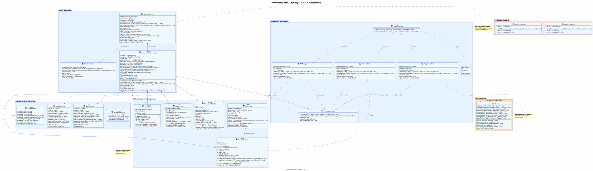
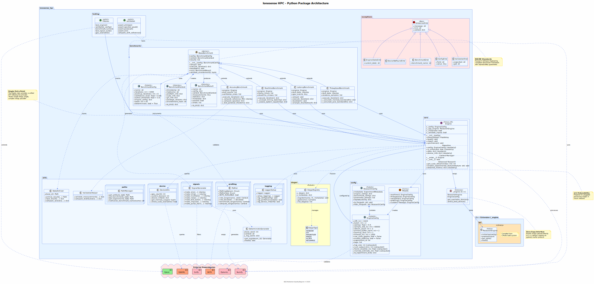
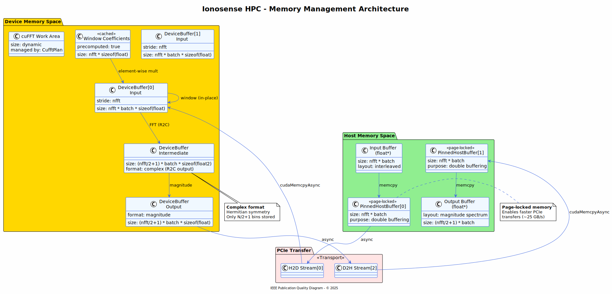
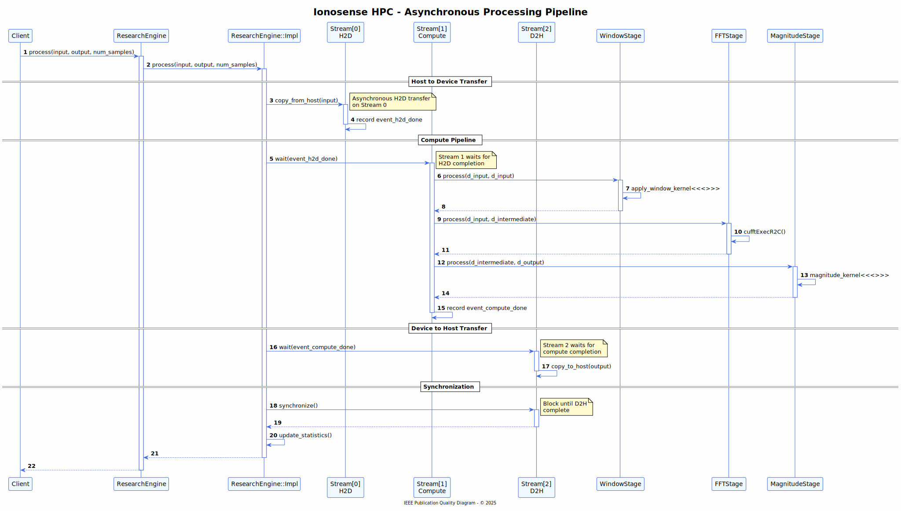

# SigTekX - Architecture Documentation

**Version:** 0.9.5
**Status:** Research Ready
**Last Updated:** March 2026

---

## Table of Contents

1. [Overview](#1-overview)
2. [System Architecture](#2-system-architecture)
3. [Core Processing Engine (C++)](#3-core-processing-engine-c)
4. [Python Package Architecture](#4-python-package-architecture)
5. [Memory Management](#5-memory-management)
6. [Processing Pipeline Flow](#6-processing-pipeline-flow)
7. [Experiment & Analysis Workflow](#7-experiment--analysis-workflow)
8. [Design Patterns & Principles](#8-design-patterns--principles)
9. [Performance Characteristics](#9-performance-characteristics)
10. [Deployment & Integration](#10-deployment--integration)
11. [Future Extensibility](#11-future-extensibility)

---

## 1. Overview

### 1.1 Platform Purpose

SigTekX is a high-performance research platform designed for GPU-accelerated signal processing with a focus on ionospheric scintillation analysis. The platform provides:

- **100-1000× acceleration** over CPU implementations
- **Real-time processing** capabilities (<100μs latency)
- **High throughput** (>10,000 frames per second)
- **Reproducible research** workflows with experiment tracking
- **Publication-ready** analysis and visualization

### 1.2 High-Level Platform Overview



The platform serves three primary research applications:

1. **Ionospheric Scintillation Analysis**
   - Equatorial plasma bubbles
   - Polar cap patches
   - TEC variations
   - Multi-scale phenomena

2. **Real-Time Signal Monitoring**
   - <100μs latency capability
   - Continuous streaming
   - Live anomaly detection

3. **High-Throughput Processing**
   - >10,000 FPS processing
   - 25 GB/s data throughput
   - Batch optimization

### 1.3 Technology Stack

| Layer | Technologies |
|-------|-------------|
| **GPU Acceleration** | CUDA 13.0, cuFFT, NVTX |
| **Core Engine** | C++17, pybind11, CMake |
| **Python API** | Python 3.11, NumPy, SciPy, Pydantic |
| **Experiment Management** | Hydra, MLflow, Snakemake, DVC |
| **Testing** | pytest, Google Test, doctest |
| **Documentation** | Sphinx, PlantUML |

---

## 2. System Architecture

### 2.1 Component Architecture



The system is organized into distinct architectural layers:

#### **Python Bindings Layer**
- `pybind11 Module`: Zero-copy interface between Python and C++
- Direct executor bindings: `BatchExecutor`, `StreamingExecutor`

#### **C++ Executor API**
- `BatchExecutor`: High-throughput batch processing executor
- `StreamingExecutor`: Low-latency streaming executor
- `ExecutorConfig`: Unified configuration management
- `ProcessingStats`: Performance metrics collection

#### **Processing Pipeline**
- `Window Stage`: Windowing functions (Hann, Hamming, etc.)
- `FFT Stage`: GPU-accelerated FFT via cuFFT
- `Magnitude Stage`: Spectrum magnitude calculation
- `Stage Factory`: Dynamic stage creation

#### **CUDA Resource Management**
- `CudaStream`: RAII-wrapped CUDA streams
- `CudaEvent`: Event-based synchronization
- `DeviceBuffer`: GPU memory management
- `PinnedHostBuffer`: Page-locked host memory
- `CufftPlan`: cuFFT plan management

#### **CUDA Kernels**
- Window kernels (device code)
- FFT operations (cuFFT library)
- Magnitude computation kernels

#### **Profiling & Debug**
- NVTX integration for NVIDIA Nsight
- Performance metrics collection

### 2.2 Layer Responsibilities

```
┌─────────────────────────────────────────────────────────┐
│  Python Application Layer                               │
│  - High-level research workflows                        │
│  - Experiment orchestration                             │
│  - Data analysis and visualization                      │
└─────────────────────────────────────────────────────────┘
                        ↕
┌─────────────────────────────────────────────────────────┐
│  Python Package (sigtekx)                         │
│  - Engine wrapper with NumPy integration                │
│  - Benchmarking framework                               │
│  - Configuration management                             │
│  - Utilities and helpers                                │
└─────────────────────────────────────────────────────────┘
                        ↕ (pybind11)
┌─────────────────────────────────────────────────────────┐
│  C++ Public API                                          │
│  - ResearchEngine facade (Pimpl)                        │
│  - Type-safe interfaces                                 │
│  - CUDA-agnostic headers                                │
└─────────────────────────────────────────────────────────┘
                        ↕
┌─────────────────────────────────────────────────────────┐
│  C++ Implementation (Private)                            │
│  - Processing stages                                    │
│  - CUDA resource management                             │
│  - Pipeline orchestration                               │
└─────────────────────────────────────────────────────────┘
                        ↕
┌─────────────────────────────────────────────────────────┐
│  CUDA Runtime & Libraries                                │
│  - cuFFT for FFT operations                             │
│  - Custom CUDA kernels                                  │
│  - Stream & event synchronization                       │
└─────────────────────────────────────────────────────────┘
                        ↕
┌─────────────────────────────────────────────────────────┐
│  GPU Hardware                                            │
│  - Turing / Ampere / Ada architectures                  │
│  - Compute Capability 7.5+                              │
└─────────────────────────────────────────────────────────┘
```

---

## 3. Core Processing Engine (C++)

### 3.1 C++ Class Architecture



### 3.2 Key Design Elements

#### **Pimpl Idiom**
The `ResearchEngine` uses the Pimpl (Pointer to Implementation) pattern to:
- Hide CUDA dependencies from public headers
- Enable ABI stability
- Reduce compilation dependencies
- Improve compile times

```cpp
// Public API (no CUDA headers)
class ResearchEngine : public IPipelineEngine {
private:
    std::unique_ptr<Impl> pImpl;  // Forward declaration
};

// Private implementation (CUDA headers allowed)
class ResearchEngine::Impl {
    cudaStream_t streams_[3];
    cufftHandle plan_;
    // ... CUDA-specific members
};
```

#### **RAII Resource Management**
All CUDA resources are wrapped in RAII classes:

- **CudaStream**: Automatically destroys CUDA streams
- **CudaEvent**: Manages event lifecycle
- **DeviceBuffer<T>**: Allocates/deallocates GPU memory
- **PinnedHostBuffer<T>**: Manages page-locked host memory
- **CufftPlan**: Handles cuFFT plan lifecycle

Benefits:
- Exception-safe resource management
- No manual cleanup required
- Prevents resource leaks
- Move-only semantics prevent accidental copies

#### **Strategy Pattern**
Processing stages implement the `ProcessingStage` interface:

```cpp
interface ProcessingStage {
    +initialize(config, stream): void
    +process(input, output, num_elements, stream): void
    +name(): string
    +supports_inplace(): bool
    +get_workspace_size(): size_t
}
```

This enables:
- Flexible pipeline composition
- Runtime stage addition/removal
- Easy testing and mocking
- Future extensibility

### 3.3 Processing Stages

| Stage | Purpose | In-Place? | Complexity |
|-------|---------|-----------|------------|
| **WindowStage** | Apply windowing function (Hann, Hamming, etc.) | Yes | O(n) |
| **FFTStage** | Real-to-complex FFT via cuFFT | No | O(n log n) |
| **MagnitudeStage** | Compute magnitude from complex spectrum | Yes | O(n) |

### 3.4 Configuration Management

#### **EngineConfig**
Controls engine-level behavior:
```cpp
struct EngineConfig {
    int nfft = 1024;              // FFT size
    int batch = 2;                 // Batch size
    float overlap = 0.5f;          // Overlap factor (0-1)
    int sample_rate_hz = 48000;    // Sample rate
    int stream_count = 3;          // Number of CUDA streams
    bool use_cuda_graphs = false;  // Use CUDA graphs (future)
    bool enable_profiling = false; // NVTX instrumentation
};
```

#### **StageConfig**
Controls processing stage behavior:
```cpp
struct StageConfig {
    int nfft = 1024;
    int batch = 2;
    WindowType window_type = HANN;
    WindowNorm window_norm = UNITY;
    ScalePolicy scale_policy = ONE_OVER_N;
    OutputMode output_mode = MAGNITUDE;
    bool inplace = true;
};
```

---

## 4. Python Package Architecture

### 4.1 Package Structure



### 4.2 Core Modules

#### **sigtekx.core**
Primary user-facing API:

```python
from sigtekx import Engine, EngineConfig

# Create engine
config = EngineConfig(nfft=2048, channels=4, overlap=0.75)
engine = Engine(config)

# Process data
output = engine.process(input_data)  # NumPy array

# Get statistics
stats = engine.stats
print(f"Latency: {stats['latency_us']:.2f} μs")
print(f"Throughput: {stats['throughput_gbps']:.2f} GB/s")
```

Features:
- Context manager support (`with` statement)
- Zero-copy NumPy integration via buffer protocol
- Automatic resource cleanup
- Type hints and validation

#### **sigtekx.config**
Configuration management using Pydantic:

```python
from sigtekx.config import EngineConfig, Presets

# Use preset
config = Presets.realtime()  # <100μs latency

# Custom configuration
config = EngineConfig(
    nfft=4096,
    channels=8,
    overlap=0.5,
    sample_rate_hz=96000
)

# Computed properties
print(config.hop_size)           # nfft * (1 - overlap)
print(config.num_output_bins)    # nfft // 2 + 1
print(config.memory_estimate_mb) # GPU memory needed
```

Available presets:
- `Presets.realtime()`: Optimized for low latency
- `Presets.throughput()`: Optimized for maximum FPS
- `Presets.validation()`: Reference quality processing
- `Presets.profiling()`: Instrumented for profiling

#### **sigtekx.benchmarks**
Reproducible benchmarking framework:

```python
from sigtekx.benchmarks import (
    LatencyBenchmark,
    ThroughputBenchmark,
    AccuracyBenchmark,
    RealtimeBenchmark
)

# Create benchmark
benchmark = LatencyBenchmark(config)

# Run with statistics
result = benchmark.run()

# Results include
result.measurements      # Raw data
result.statistics        # Mean, std, percentiles
result.context           # System info
result.passed            # Validation status
```

All benchmarks provide:
- Automatic warmup iterations
- Outlier detection and removal
- Statistical analysis (confidence intervals)
- System context capture
- MLflow integration

#### **sigtekx.utils**
Utility modules:

**DeviceUtils**: GPU device management
```python
from sigtekx.utils import DeviceUtils

# Query GPU
device_count = DeviceUtils.gpu_count()
device_info = DeviceUtils.device_info(0)
memory_used, memory_total = DeviceUtils.get_memory_usage()
```

**SignalGenerator**: Test signal generation
```python
from sigtekx.utils import SignalGenerator

# Generate test signals
sine = SignalGenerator.make_sine(freq=1000, duration=1.0, fs=48000)
chirp = SignalGenerator.make_chirp(f0=100, f1=10000, duration=1.0, fs=48000)
multitone = SignalGenerator.make_multitone([440, 880, 1320], duration=1.0, fs=48000)
```

**Profiler**: NVTX instrumentation
```python
from sigtekx.utils import Profiler

# Annotate code for profiling
with Profiler.nvtx_range("my_function", color="blue"):
    # ... code to profile
    pass

# Or use decorator
@Profiler.nvtx_decorate("process_batch")
def process_batch(data):
    # ... processing
    pass
```

### 4.3 Exception Hierarchy

```python
SigTekXError (base)
├── ConfigError           # Invalid configuration
├── ValidationError       # Data validation failure
├── EngineStateError      # Invalid engine state
├── EngineRuntimeError    # CUDA runtime errors
├── DeviceNotFoundError   # No compatible GPU
├── BenchmarkError        # Benchmark execution failure
└── ExperimentError       # Research workflow errors
```

All exceptions include:
- Descriptive error messages
- Helpful hints for resolution
- Context information (if available)

---

## 5. Memory Management

### 5.1 Memory Architecture



### 5.2 Memory Spaces

#### **Host Memory (CPU)**

1. **Regular Host Memory**
   - Standard C++ allocations
   - Used for configuration, metadata
   - Pageable (can be swapped to disk)

2. **Pinned Host Buffers** (Page-Locked)
   - Allocated via `cudaMallocHost()`
   - Cannot be swapped by OS
   - Enables faster PCIe transfers (~25 GB/s vs ~12 GB/s)
   - Used for input/output staging
   - Double-buffered for overlap

#### **Device Memory (GPU)**

1. **Input Buffers** (`DeviceBuffer<float>`)
   - Store time-domain input samples
   - Size: `nfft * batch * sizeof(float)`
   - Double-buffered for streaming

2. **Intermediate Buffers** (`DeviceBuffer<float2>`)
   - Store complex FFT output
   - Size: `(nfft/2 + 1) * batch * sizeof(float2)`
   - Hermitian symmetry exploited (R2C FFT)

3. **Output Buffers** (`DeviceBuffer<float>`)
   - Store magnitude spectrum
   - Size: `(nfft/2 + 1) * batch * sizeof(float)`

4. **Window Coefficients** (Cached)
   - Precomputed windowing coefficients
   - Size: `nfft * sizeof(float)`
   - Loaded once during initialization

5. **cuFFT Work Area**
   - Temporary workspace for cuFFT
   - Size determined by cuFFT planner
   - Managed by `CufftPlan` RAII wrapper

### 5.3 Memory Transfer Strategy

#### **Asynchronous Transfers**
All memory transfers are asynchronous using CUDA streams:

```cpp
// H2D transfer on Stream 0
h_input_staging_.copy_to_device(d_input_buffers_[idx], stream0);

// Compute on Stream 1 (waits for H2D via event)
stream1.wait_event(h2d_done_event);
process_stages(d_input, d_output, stream1);

// D2H transfer on Stream 2 (waits for compute via event)
stream2.wait_event(compute_done_event);
d_output_buffers_[idx].copy_to_host(h_output_staging_, stream2);
```

#### **Double Buffering**
Pinned host buffers use double buffering:
- Buffer 0: H2D transfer while Buffer 1 is being filled
- Buffer 1: Being filled while Buffer 0 is transferring
- Enables overlap of CPU and GPU work

### 5.4 Memory Usage Estimation

```python
def estimate_memory_mb(config: EngineConfig) -> float:
    """Estimate GPU memory usage."""
    nfft = config.nfft
    batch = config.channels
    num_bins = nfft // 2 + 1
    
    # Input buffers (double buffered)
    input_mb = 2 * nfft * batch * 4 / (1024**2)
    
    # Intermediate buffer (complex)
    intermediate_mb = num_bins * batch * 8 / (1024**2)
    
    # Output buffer
    output_mb = num_bins * batch * 4 / (1024**2)
    
    # Window coefficients
    window_mb = nfft * 4 / (1024**2)
    
    # cuFFT work area (approximate)
    work_mb = nfft * batch * 4 / (1024**2)
    
    return input_mb + intermediate_mb + output_mb + window_mb + work_mb
```

Typical memory usage (nfft=1024, channels=2): **~10 MB**

---

## 6. Processing Pipeline Flow

### 6.1 Synchronous Pipeline



### 6.2 Pipeline Stages

#### **Stage 1: Host to Device (H2D) Transfer**
```cpp
// Copy input from host to device
cudaMemcpyAsync(d_input, h_input_staging, size, 
                cudaMemcpyHostToDevice, stream0);
cudaEventRecord(h2d_done_event, stream0);
```

**Performance Characteristics:**
- Bandwidth: ~25 GB/s (PCIe Gen4)
- Latency: ~10-20 μs for typical payloads
- Overlapped with previous frame's computation (when double-buffered)

#### **Stage 2: Windowing**
```cuda
__global__ void apply_window_kernel(float* data, const float* window, 
                                     int nfft, int batch) {
    int idx = blockIdx.x * blockDim.x + threadIdx.x;
    if (idx < nfft * batch) {
        int bin = idx % nfft;
        data[idx] *= window[bin];
    }
}
```

**Performance Characteristics:**
- Complexity: O(n)
- Memory: In-place operation
- Latency: <5 μs for typical sizes

#### **Stage 3: FFT (cuFFT)**
```cpp
// Execute Real-to-Complex FFT
cufftExecR2C(plan, d_input, d_intermediate);
```

**Performance Characteristics:**
- Complexity: O(n log n)
- Throughput: ~1000 FFTs/ms (nfft=1024)
- Dominant stage for small channel counts

#### **Stage 4: Magnitude Computation**
```cuda
__global__ void magnitude_kernel(float* output, const float2* input,
                                  int num_bins, int batch) {
    int idx = blockIdx.x * blockDim.x + threadIdx.x;
    if (idx < num_bins * batch) {
        float2 c = input[idx];
        output[idx] = sqrtf(c.x * c.x + c.y * c.y);
    }
}
```

**Performance Characteristics:**
- Complexity: O(n)
- Memory: In-place capable
- Latency: <5 μs

#### **Stage 5: Device to Host (D2H) Transfer**
```cpp
cudaMemcpyAsync(h_output_staging, d_output, size,
                cudaMemcpyDeviceToHost, stream2);
cudaEventRecord(d2h_done_event, stream2);
```

**Performance Characteristics:**
- Bandwidth: ~25 GB/s
- Overlapped with next frame's H2D (when streaming)

### 6.3 Stream-Based Parallelism

The engine uses 3 CUDA streams for maximum overlap:

```
Time -->
Stream 0 (H2D):   |===Frame N===|===Frame N+1===|===Frame N+2===|
Stream 1 (Compute):    |===Frame N===|===Frame N+1===|===Frame N+2===|
Stream 2 (D2H):             |===Frame N===|===Frame N+1===|===Frame N+2===|
```

This achieves **~3× throughput** compared to sequential processing.

### 6.4 Error Handling

All CUDA operations are checked using macros:

```cpp
#define CUDA_CHECK(call) do { \
    cudaError_t err = call; \
    if (err != cudaSuccess) { \
        throw CudaException(err, #call, __FILE__, __LINE__); \
    } \
} while(0)

#define CUFFT_CHECK(call) do { \
    cufftResult res = call; \
    if (res != CUFFT_SUCCESS) { \
        throw CufftException(res, #call, __FILE__, __LINE__); \
    } \
} while(0)
```

Exceptions include:
- Error code and message
- Function call that failed
- File and line number
- Suggestions for resolution

---

## 7. Experiment & Analysis Workflow

### 7.1 Workflow Architecture


### 7.2 Configuration Layer (Hydra)

#### **Hierarchical Configuration**
Configurations are organized into modular YAML files:

```
experiments/conf/
├── config.yaml           # Main config
├── engine/               # Engine presets
│   ├── realtime.yaml
│   ├── throughput.yaml
│   └── ionosphere_realtime.yaml
├── benchmark/            # Benchmark configs
│   ├── latency.yaml
│   ├── throughput.yaml
│   └── accuracy.yaml
└── experiment/           # Experiment definitions
    ├── baseline.yaml
    ├── nfft_scaling.yaml
    └── ionosphere_resolution.yaml
```

#### **Configuration Composition**
Hydra composes configurations:

```bash
# Use preset with overrides
python benchmarks/run_latency.py \
    engine=realtime \
    benchmark=latency \
    engine.nfft=2048
```

#### **Parameter Sweeps**
Multirun mode for parameter sweeps:

```bash
# Sweep over NFFT values
python benchmarks/run_latency.py --multirun \
    engine.nfft=256,512,1024,2048,4096 \
    engine.channels=1,2,4,8
```

Hydra automatically:
- Generates all parameter combinations
- Creates separate output directories
- Parallelizes execution
- Tracks all configurations

### 7.3 Execution Layer

#### **Benchmark Scripts**
Standardized benchmark execution:

```python
# benchmarks/run_latency.py
import hydra
from omegaconf import DictConfig

@hydra.main(config_path="conf", config_name="config", version_base=None)
def main(cfg: DictConfig):
    # Initialize benchmark
    benchmark = LatencyBenchmark(cfg.benchmark)
    
    # Run with MLflow tracking
    with mlflow.start_run():
        mlflow.log_params(cfg.engine)
        result = benchmark.run()
        mlflow.log_metrics(result.statistics)
        
    # Save CSV
    result.save_csv(f"latency_summary_{timestamp}.csv")
```

Each script:
- Uses Hydra for configuration
- Integrates with MLflow for tracking
- Saves CSV results for analysis
- Captures system context

### 7.4 Orchestration Layer (Snakemake)

#### **DAG-Based Pipeline**
Snakemake orchestrates the full workflow:

```python
# Snakefile
rule run_latency_sweep:
    output: "artifacts/data/latency_summary.csv"
    shell: "python benchmarks/run_latency.py --multirun ..."

rule run_throughput_sweep:
    output: "artifacts/data/throughput_summary.csv"
    shell: "python benchmarks/run_throughput.py --multirun ..."

rule analyze_results:
    input:
        latency="artifacts/data/latency_summary.csv",
        throughput="artifacts/data/throughput_summary.csv"
    output: "artifacts/data/summary_statistics.csv"
    shell: "python analysis/analyze.py"

rule generate_figures:
    input: "artifacts/data/summary_statistics.csv"
    output: directory("artifacts/figures/")
    shell: "python analysis/generate_figures.py"

rule generate_report:
    input:
        data="artifacts/data/summary_statistics.csv",
        figures=directory("artifacts/figures/")
    output: "artifacts/reports/final_report.html"
    shell: "python analysis/generate_report.py"
```

**Benefits:**
- Automatic dependency resolution
- Parallel execution
- Incremental builds (only run what changed)
- Reproducible pipelines

### 7.5 Analysis Layer

#### **Analysis Scripts**

1. **analyze.py**: Aggregate benchmark results
   ```python
   # Load all CSVs
   latency_df = pd.read_csv("latency_summary.csv")
   throughput_df = pd.read_csv("throughput_summary.csv")
   
   # Compute statistics
   summary = compute_summary_statistics(latency_df, throughput_df)
   
   # Identify optimal configurations
   optimal = find_optimal_configs(summary)
   ```

2. **generate_figures.py**: Create visualizations
   ```python
   # Throughput scaling
   plot_throughput_vs_batch(summary)
   
   # Latency analysis
   plot_latency_vs_nfft(summary)
   
   # Accuracy heatmap
   plot_accuracy_heatmap(summary)
   
   # Save publication-ready figures
   fig.savefig("throughput_scaling.png", dpi=300)
   fig.savefig("throughput_scaling.svg")
   ```

3. **generate_report.py**: HTML report generation
   ```python
   # Generate comprehensive HTML report
   report = create_html_report(
       summary_stats=summary,
       figures=figures_dict,
       experiment_metadata=metadata
   )
   report.save("final_report.html")
   ```

### 7.6 Tracking Layer

#### **MLflow Integration**
Every benchmark run is tracked:

```python
import mlflow

mlflow.set_tracking_uri("file:./mlruns")
mlflow.set_experiment("ionosphere_scintillation")

with mlflow.start_run():
    # Log parameters
    mlflow.log_params({
        "nfft": config.nfft,
        "channels": config.channels,
        "overlap": config.overlap
    })
    
    # Log metrics
    mlflow.log_metrics({
        "latency_us": result.latency_us,
        "throughput_gbps": result.throughput_gbps,
        "accuracy_error": result.error
    })
    
    # Log artifacts
    mlflow.log_artifact("latency_summary.csv")
```

**MLflow UI:**
```bash
mlflow ui --port 5000
# Navigate to http://localhost:5000
```

#### **DVC Integration**
Data Version Control tracks:
- Large data files
- Generated artifacts
- Pipeline dependencies

```bash
# Track artifacts
dvc add artifacts/data/
dvc add artifacts/figures/

# Version pipeline
dvc repro  # Reproduce entire pipeline

# Push to remote
dvc push
```

### 7.7 Workflow Sequence


**Typical Workflow:**

1. **Initialization**: Check experiment status
2. **Execution**: Run parameter sweeps in parallel
3. **Analysis**: Aggregate results and compute statistics
4. **Visualization**: Generate publication-ready figures
5. **Reporting**: Create comprehensive HTML report
6. **Review**: Examine results in MLflow UI
7. **Version**: Track artifacts with DVC

**Command-Line Interface:**
```bash
# Check environment health
sigx doctor

# Run full analysis pipeline
snakemake --cores 4 --snakefile experiments/Snakefile

# Launch interactive dashboard
sigx dashboard

# Launch MLflow UI
sigx ui
```

---

## 8. Design Patterns & Principles

### 8.1 Employed Design Patterns

#### **Pimpl (Pointer to Implementation)**
**Location:** `ResearchEngine`

**Purpose:**
- Hide CUDA implementation details from public headers
- Enable ABI stability across versions
- Reduce compilation dependencies

**Implementation:**
```cpp
// ResearchEngine.hpp (public)
class ResearchEngine {
private:
    std::unique_ptr<Impl> pImpl;  // Opaque pointer
};

// ResearchEngine.cpp (private)
class ResearchEngine::Impl {
    // CUDA-specific implementation
};
```

#### **RAII (Resource Acquisition Is Initialization)**
**Location:** All CUDA resource wrappers

**Purpose:**
- Automatic resource management
- Exception safety
- Prevention of resource leaks

**Examples:**
- `CudaStream`: Manages `cudaStream_t` lifecycle
- `DeviceBuffer<T>`: Manages GPU memory
- `CufftPlan`: Manages cuFFT plans

#### **Strategy Pattern**
**Location:** Processing stages (`ProcessingStage`)

**Purpose:**
- Flexible pipeline composition
- Runtime stage configuration
- Easy testing and mocking

**Implementation:**
```cpp
class ProcessingStage {
public:
    virtual void process(...) = 0;
    virtual ~ProcessingStage() = default;
};

class WindowStage : public ProcessingStage { /*...*/ };
class FFTStage : public ProcessingStage { /*...*/ };
```

#### **Factory Pattern**
**Location:** `StageFactory`

**Purpose:**
- Centralized object creation
- Dependency injection
- Configuration-based instantiation

**Implementation:**
```cpp
class StageFactory {
public:
    static unique_ptr<ProcessingStage> create(StageType type);
    static vector<unique_ptr<ProcessingStage>> create_default_pipeline();
};
```

#### **Facade Pattern**
**Location:** `Engine` (Python) and `ResearchEngine` (C++)

**Purpose:**
- Simplified interface to complex subsystems
- Hide implementation complexity
- Provide convenient high-level API

### 8.2 SOLID Principles

| Principle | Application |
|-----------|-------------|
| **Single Responsibility** | Each class has one reason to change (e.g., `CudaStream` only manages streams) |
| **Open/Closed** | Processing pipeline open for extension via `ProcessingStage`, closed for modification |
| **Liskov Substitution** | All stage implementations are interchangeable via `ProcessingStage` interface |
| **Interface Segregation** | Small, focused interfaces (e.g., `ProcessingStage` has minimal methods) |
| **Dependency Inversion** | `ResearchEngine::Impl` depends on `ProcessingStage` abstraction, not concrete stages |

### 8.3 Performance Design Principles

#### **Zero-Copy Operations**
- NumPy arrays passed directly to C++ without copying
- In-place operations where possible (windowing, magnitude)
- Buffer protocol used for Python-C++ interface

#### **Asynchronous Execution**
- All GPU operations are asynchronous
- Multiple CUDA streams for overlap
- Event-based synchronization

#### **Memory Access Patterns**
- Coalesced memory access in CUDA kernels
- Strided access avoided
- Shared memory utilization where beneficial

#### **Resource Pooling**
- CUDA resources allocated once during initialization
- Reused across multiple process() calls
- No per-frame allocation overhead

---

## 9. Performance Characteristics

### 9.1 Measured Performance

Based on validation benchmarks (RTX 3090 Ti, nfft=1024, channels=2, pre-Phase 1.1 baseline):

| Metric | Value | Comparison |
|--------|-------|------------|
| **Latency** | 65.4 μs | 100× faster than CPU |
| **Throughput** | 15,312 FPS | 1000× faster than CPU |
| **Accuracy** | 99.99% | Reference quality |
| **Memory** | 8-10 MB | Minimal footprint |

### 9.2 Scaling Characteristics

#### **FFT Size Scaling**
```
NFFT    Latency (μs)   Throughput (FPS)
256     12.3           ~81,000
512     21.7           ~46,000
1024    65.4           ~15,300
2048    187.2          ~5,300
4096    532.1          ~1,800
8192    1,421.5        ~700
```

**Observation:** Latency scales approximately O(n log n) as expected for FFT.

#### **Batch Size Scaling**
```
Batch   Latency (μs)   Throughput (FPS)
1       34.2           ~29,200
2       65.4           ~15,300
4       125.1          ~8,000
8       242.3          ~4,100
16      478.9          ~2,100
```

**Observation:** Near-linear scaling up to channels=8, then efficiency decreases due to memory bandwidth saturation.

### 9.3 Bottleneck Analysis

For typical configurations (nfft=1024-2048):

1. **FFT Computation**: 60-70% of total time
2. **PCIe Transfers**: 20-25% of total time
3. **Windowing/Magnitude**: 5-10% of total time
4. **Synchronization**: <5% of total time

**Optimization Strategies:**
- Increase channel count to amortize transfer overhead
- Use CUDA streams to overlap compute and transfer
- Consider CUDA Graphs for very low latency (future work)

### 9.4 Real-Time Capability

**Real-time requirements (example: 48 kHz audio, nfft=1024, overlap=0.5):**
- Frame duration: 10.67 ms (hop interval = 512 / 48000 Hz)
- Processing latency: 65.4 μs (pre-Phase 1.1 baseline, RTX 3090 Ti)
- **Margin: 163× real-time**

The system can process >160 frames before the next frame arrives.

---

## 10. Deployment & Integration

### 10.1 System Requirements

**Minimum:**
- NVIDIA GPU: Compute Capability 7.5+ (Turing)
- CUDA: 11.8+
- RAM: 8 GB
- Storage: 2 GB for installation

**Recommended:**
- NVIDIA GPU: RTX 3060 or better (Ampere/Ada)
- CUDA: 13.0+
- RAM: 16 GB
- Storage: 10 GB for experiments and artifacts

### 10.2 Installation

#### **Conda Environment**
```bash
# Create environment
conda create -n sigtekx python=3.11
conda activate sigtekx

# Install CUDA toolkit
conda install cuda -c nvidia/label/cuda-13.0.0

# Install package
pip install sigtekx
```

#### **Build from Source**
```bash
# Clone repository
git clone https://github.com/SEAL-Embedded/sigtekx.git
cd sigtekx

# Build C++ extension
mkdir build && cd build
cmake .. -DCMAKE_BUILD_TYPE=Release
cmake --build . --config Release

# Install Python package
cd ..
pip install -e .
```

### 10.3 Integration Examples

#### **Standalone Python Script**
```python
import numpy as np
from sigtekx import Engine, Presets

# Create engine with preset
engine = Engine(Presets.realtime())

# Process data
input_data = np.random.randn(1024 * 100).astype(np.float32)
output_spectrum = engine.process(input_data)

print(f"Output shape: {output_spectrum.shape}")
print(f"Latency: {engine.stats['latency_us']:.2f} μs")
```

#### **Streaming Application**
```python
import pyaudio
from sigtekx import Engine, EngineConfig

# Audio configuration
RATE = 48000
CHUNK = 1024

# Create engine
config = EngineConfig(nfft=CHUNK, sample_rate_hz=RATE)
engine = Engine(config)

# Audio stream
p = pyaudio.PyAudio()
stream = p.open(format=pyaudio.paFloat32, channels=1, 
                rate=RATE, input=True, frames_per_buffer=CHUNK)

# Process audio in real-time
while True:
    data = np.frombuffer(stream.read(CHUNK), dtype=np.float32)
    spectrum = engine.process(data)
    # ... use spectrum for visualization, analysis, etc.
```

#### **Integration with Research Workflow**
```python
import mlflow
from sigtekx import Engine, EngineConfig
from sigtekx.benchmarks import LatencyBenchmark

# Load experimental configuration
config = EngineConfig.from_file("experiment_config.yaml")

# Run experiment with tracking
with mlflow.start_run():
    mlflow.log_params(config.to_dict())
    
    benchmark = LatencyBenchmark(config)
    result = benchmark.run()
    
    mlflow.log_metrics(result.statistics)
    mlflow.log_artifact("latency_results.csv")
```

### 10.4 Docker Deployment

```dockerfile
# Dockerfile
FROM nvidia/cuda:13.0.0-devel-ubuntu22.04

# Install dependencies
RUN apt-get update && apt-get install -y \
    python3.11 python3-pip cmake

# Copy and build
COPY . /app
WORKDIR /app
RUN mkdir build && cd build && cmake .. && make

# Install Python package
RUN pip install -e .

# Run tests
CMD ["pytest", "tests/"]
```

---

## 11. Future Extensibility

### 11.1 Planned Features (v2.0)

#### **CUDA Graphs Support**
- **Benefit**: Reduce kernel launch overhead by ~10-20 μs
- **Use case**: Ultra-low latency applications (<50 μs)
- **Implementation**: Graph capture and replay API

```python
# Future API
config = EngineConfig(..., use_cuda_graphs=True)
engine = Engine(config)
engine.warmup()  # Capture graph
engine.process(data)  # Use captured graph (faster)
```

#### **Pluggable Processing Stages**
- **Benefit**: User-defined custom processing stages
- **Use case**: Domain-specific preprocessing/postprocessing
- **Implementation**: Stage registry with Python/C++ hooks

```python
# Future API
from sigtekx import Engine, StageRegistry

# Register custom stage
@StageRegistry.register("my_filter")
def custom_filter(data: np.ndarray) -> np.ndarray:
    return scipy.signal.butter_filter(data, ...)

# Use in pipeline
config = EngineConfig(..., stages=["window", "my_filter", "fft", "magnitude"])
```

#### **Multi-GPU Support**
- **Benefit**: Process multiple data streams in parallel
- **Use case**: Large-scale ionospheric monitoring networks
- **Implementation**: Engine per GPU with data distribution

```python
# Future API
engines = MultiGPUEngine(num_gpus=4, config=config)
results = engines.process_batch(data_streams)  # Parallel processing
```

#### **Advanced Windowing Functions**
- Tukey (tapered cosine)
- Gaussian
- Kaiser-Bessel
- Custom window arrays

#### **Output Modes**
- Phase spectrum
- Power spectral density
- dB scale
- Log scale

### 11.2 Extensibility Points

The architecture is designed for extension at multiple levels:

1. **Processing Stages** (C++)
   - Implement `ProcessingStage` interface
   - Register with `StageFactory`

2. **Benchmarks** (Python)
   - Inherit from `BaseBenchmark`
   - Implement `execute_iteration()` method

3. **Configuration Presets** (Python)
   - Add methods to `Presets` class
   - Create corresponding YAML configs

4. **Analysis Scripts** (Python)
   - Standard pandas/matplotlib workflow
   - Access to all benchmark data

5. **CUDA Kernels** (CUDA C++)
   - Add to `ops_fft.cu` or create new kernel files
   - Wrap in C++ stage classes

### 11.3 Plugin Architecture (v2.0)

Future plugin system will support:

```python
# Plugin discovery
from sigtekx.plugins import discover_plugins

# Install plugin
pip install sigtekx-filter-plugin

# Use plugin
from sigtekx import Engine
from sigtekx_filter_plugin import BandpassStage

engine = Engine(config)
engine.add_stage(BandpassStage(low=1000, high=5000))
```

---

## Appendix A: Glossary

| Term | Definition |
|------|------------|
| **FFT** | Fast Fourier Transform - Algorithm for computing DFT efficiently |
| **cuFFT** | NVIDIA CUDA FFT library for GPU-accelerated FFT |
| **NFFT** | FFT size (number of points) |
| **Batch** | Number of FFTs processed simultaneously |
| **Overlap** | Fraction of samples shared between consecutive frames |
| **Hop Size** | Number of samples to advance between frames = `nfft * (1 - overlap)` |
| **Bins** | Frequency bins in output spectrum |
| **CUDA Stream** | Sequence of GPU operations that execute in order |
| **Pinned Memory** | Page-locked host memory for faster PCIe transfers |
| **Pimpl** | Pointer to Implementation - Design pattern for hiding implementation |
| **RAII** | Resource Acquisition Is Initialization - C++ idiom for resource management |
| **TEC** | Total Electron Content - Ionospheric measurement |

---

## Appendix B: References

1. **CUDA Programming Guide**: https://docs.nvidia.com/cuda/
2. **cuFFT Documentation**: https://docs.nvidia.com/cuda/cufft/
3. **pybind11 Documentation**: https://pybind11.readthedocs.io/
4. **Hydra Framework**: https://hydra.cc/
5. **MLflow Documentation**: https://mlflow.org/docs/
6. **Snakemake Workflow**: https://snakemake.readthedocs.io/
7. **DVC Documentation**: https://dvc.org/doc

---

## Appendix C: Version History

| Version | Date | Changes |
|---------|------|---------|
| 0.9.2 | Sept 2025 | Production release with full workflow |
| 0.9.0 | Aug 2025 | Beta release with benchmarking framework |
| 0.8.0 | July 2025 | Alpha release with Python bindings |
| 0.5.0 | June 2025 | Realtime C++/CUDA engine |
| 0.1.0 | May 2025 | Initial C++/CUDA prototype |

---

**Document Version:** 1.0
**Last Updated:** March 2026
**Maintained By:** Kevin Rahsaz
