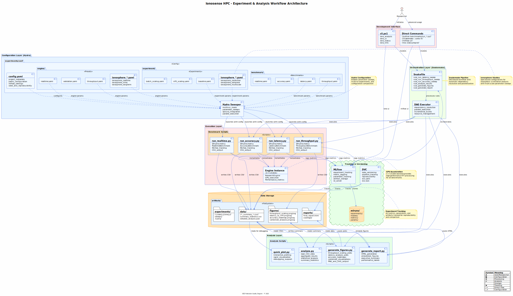
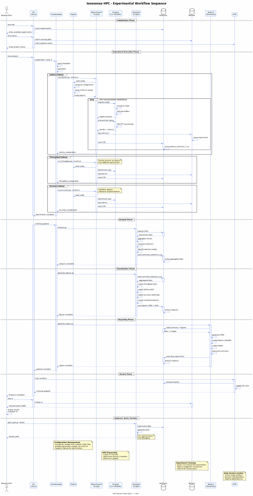

# Complete Ionosphere Experiment Workflow Guide

This guide walks through the supported path for running end-to-end ionosphere studies. The workflow relies on direct Python entry points for experimentation and Snakemake for orchestration. Use the `iono` CLI only for environment setup, formatting, linting, builds, profiling, and other maintenance tasks.

## Quick Start (Recommended)

Run the full benchmark -> analysis -> reporting pipeline with Snakemake:

```bash
snakemake --cores 4 --snakefile experiments/Snakefile
```

- Adjust `--cores` to match available CPU resources.
- Snakemake will execute all benchmark sweeps, derive summary statistics, generate figures (PNG and SVG), and build the final HTML report under `artifacts/`.
- Use `snakemake --cores 4 --snakefile experiments/Snakefile --dry-run` to preview the steps without executing them.



### Useful Snakemake targets

```bash
# Minimal smoke test of the pipeline
snakemake --cores 1 --snakefile experiments/Snakefile test

# Clean generated artifacts (uses the Snakefile rule, not the iono CLI)
snakemake --cores 1 --snakefile experiments/Snakefile clean
```

## Benchmarks and Analysis (Direct Commands)

Each benchmark script is a Hydra application that accepts configuration overrides. The Snakemake rules call these same commands under the hood. You can run them manually for iterative development:



```bash
# Throughput sweep
python benchmarks/run_throughput.py --multirun \
    experiment=baseline \
    +benchmark=throughput \
    "engine.batch=1,2,4,8,16,32,64"

# Latency sweep
python benchmarks/run_latency.py --multirun \
    experiment=baseline \
    +benchmark=latency \
    "engine.nfft=256,512,1024,2048,4096,8192"

# Accuracy sweep
python benchmarks/run_accuracy.py --multirun \
    experiment=baseline \
    +benchmark=accuracy \
    "engine.nfft=1024,2048,4096" \
    "benchmark.iterations=100"

# Analysis pipeline steps
python experiments/scripts/analyze.py
python experiments/scripts/generate_figures.py
python experiments/scripts/generate_report.py \
    --input artifacts/data/summary_statistics.csv \
    --figures-dir artifacts/figures \
    --output artifacts/reports/final_report.html
```

These commands respect the configuration defined in `experiments/conf/` and write all outputs under `artifacts/` (or the directory pointed to by `IONO_OUTPUT_ROOT`).

## Experiment Presets

Hydra experiment presets live in `experiments/conf/experiment/`. Select a preset by overriding the `experiment=` parameter:

| Preset | Purpose | Runtime | Command Snippet |
|--------|---------|---------|-----------------|
| `ionosphere_resolution` | High-resolution frequency analysis | 20-30 min | `python benchmarks/run_throughput.py --multirun experiment=ionosphere_resolution +benchmark=throughput` |
| `ionosphere_temporal` | Temporal characteristics optimisation | 30-45 min | `python benchmarks/run_latency.py --multirun experiment=ionosphere_temporal +benchmark=latency` |
| `ionosphere_multiscale` | Comprehensive multi-scale analysis | 60+ min | `python benchmarks/run_accuracy.py --multirun experiment=ionosphere_multiscale +benchmark=accuracy` |
| `quick_test` | Fast validation sweep | 5-10 min | `python benchmarks/run_latency.py experiment=quick_test +benchmark=latency benchmark.iterations=10` |
| `baseline` | Standard comparison point | 15-25 min | `python benchmarks/run_throughput.py --multirun experiment=baseline +benchmark=throughput` |

Combine presets with additional Hydra overrides (e.g., `engine.nfft=2048,4096` or `benchmark.iterations=50`) to explore parameter space.

## Custom Experiments

1. Create a new experiment config in `experiments/conf/experiment/my_custom.yaml`:

    ```yaml
    # @package _global_
    defaults:
      - override /engine: ionosphere_hires

    experiment:
      name: my_custom_study
      description: Custom ionosphere analysis
      tags: [custom, ionosphere]

    hydra:
      mode: MULTIRUN
      sweeper:
        params:
          engine.nfft: 2048,4096,8192
          engine.overlap: 0.5,0.75
          engine.batch: 8,16,32
    ```

2. Run the desired benchmark directly with Hydra overrides:

    ```bash
    python benchmarks/run_throughput.py --multirun \
        experiment=my_custom_study \
        +benchmark=throughput

    ```

   To fold the preset into the Snakemake pipeline, update the Hydra overrides inside `experiments/Snakefile` so the `experiment=` argument references `my_custom_study`.

## Viewing Results

```bash
# Launch the MLflow tracking UI to compare runs
mlflow ui --backend-store-uri file://./artifacts/mlruns

# Open the generated HTML report (Windows / macOS examples)
start artifacts/reports/final_report.html
open artifacts/reports/final_report.html
```

Outputs are organised as follows:

- `artifacts/mlruns/` - MLflow tracking data for every Hydra sweep.
- `artifacts/data/` - Raw measurements and derived summary statistics.
- `artifacts/figures/` - PNG and SVG figures produced by the analysis scripts.
- `artifacts/reports/` - Human-readable HTML report summarising each study.

## Troubleshooting

- **Environment validation**: run `python benchmarks/run_latency.py --help` to confirm dependencies resolve and Hydra loads correctly.
- **Dry-run the pipeline**: `snakemake --cores 1 --snakefile experiments/Snakefile --dry-run` shows the planned steps without executing them.
- **Configuration validation**: `python experiments/conf/validation.py experiments/conf/experiment/ionosphere_resolution.yaml`.
- **MLflow port conflicts**: `mlflow ui --backend-store-uri file://./artifacts/mlruns --port 5000`.
- **Missing Python packages**: `pip install hydra-core mlflow snakemake pandas matplotlib seaborn plotly`.

## Typical Journeys

- **Quick smoke test**: `snakemake --cores 1 --snakefile experiments/Snakefile test`.
- **Frequency resolution comparison**: `python benchmarks/run_throughput.py --multirun experiment=ionosphere_resolution +benchmark=throughput`.
- **Temporal optimisation**: `python benchmarks/run_latency.py --multirun experiment=ionosphere_temporal +benchmark=latency`.
- **Comprehensive study**: `snakemake --cores 8 --snakefile experiments/Snakefile` (ensure the Snakefile rules target `experiment=ionosphere_multiscale`).

## Next Steps

1. Execute the Snakemake quick start to generate baseline figures and reports.
2. Inspect the HTML report and MLflow UI for initial insights.
3. Iterate with targeted benchmark commands to explore alternative presets or overrides.
4. Capture adjustments to experiment configs under version control for reproducibility.

Need help? Review the output logs produced in `artifacts/logs/`, consult `docs/DEVELOPMENT.md` for debugging tips, or open an issue with the exact command and configuration details.
